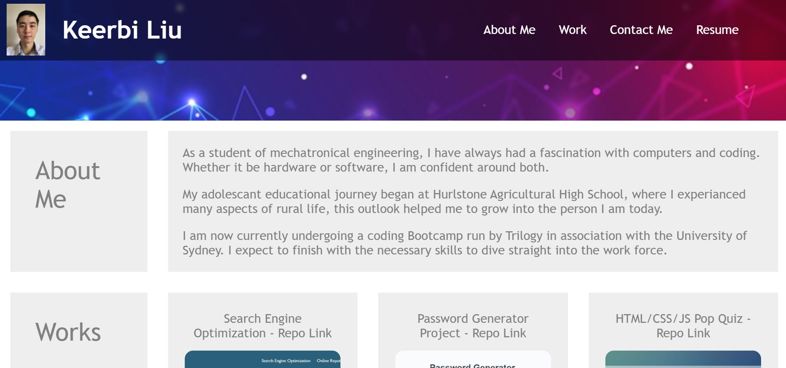

# Portfolio-Keerbi

## What is this about?

This assignment tests the skills that have been learnt in regards to css styling and designing your own website

Not only is this a fun and challenging assignment, it is also a useful tool for you to go job searching with, a well made professional portfolio will speak well on the developer who coded it.

Below you can see how the portfolio looks as it is meant to.

The nav bar helps you to quickly navigate to the desired section, whilst the mediaquery allows it to be mobile responsive.

